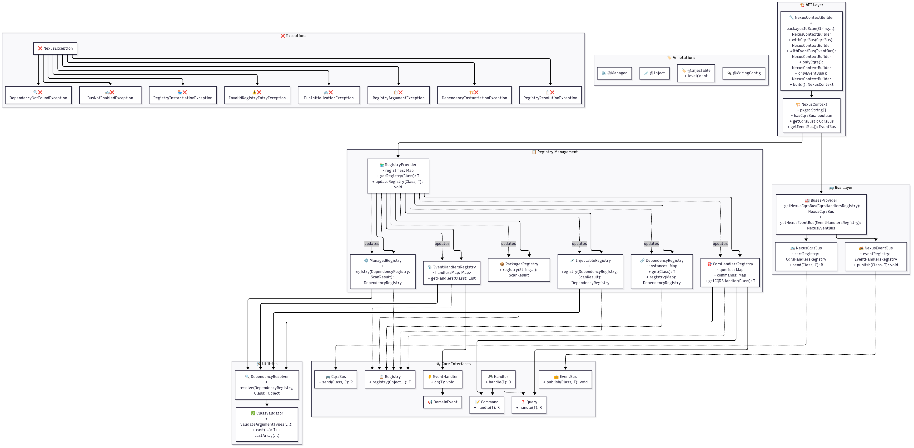

# Nexus


A lightweight, flexible library for **building modular, event-driven apps using CQRS. Use built-in command, query, and event buses for simple setups, or extend them for complex architectures**. Portable, minimal boilerplate, and adaptable to any ecosystem.

## 📖 Table of Contents

- [Nexus](#nexus)
  - [📖 Table of Contents](#-table-of-contents)
  - [🏗️ Architecture Diagram](#️-architecture-diagram)
  - [🌟 Features](#-features)
    - [🔧 **Dependency Injection**](#-dependency-injection)
    - [🎯 **CQRS Pattern**](#-cqrs-pattern)
    - [📡 **Event-Driven Architecture**](#-event-driven-architecture)
    - [⚡ **Performance \& Quality**](#-performance--quality)
  - [📦 Installation](#-installation)
    - [CMD](#cmd)
    - [Maven](#maven)
    - [Requirements](#requirements)
  - [🚀 Quick Start](#-quick-start)
    - [1. Create Your Domain Objects](#1-create-your-domain-objects)
    - [2. Set Up Dependencies](#2-set-up-dependencies)
    - [3. Initialize Nexus Context](#3-initialize-nexus-context)
  - [📚 Documentation](#-documentation)
    - [Core Annotations](#core-annotations)
    - [Context Configuration](#context-configuration)
    - [WiringConfig \& Manageds](#wiringconfig--manageds)
    - [Dependency Levels](#dependency-levels)
  - [🏗️ Architecture](#️-architecture)
    - [Registry Pattern](#registry-pattern)
    - [Bus Implementations](#bus-implementations)
  - [🧪 Testing](#-testing)
    - [Running Tests](#running-tests)
    - [Test Categories](#test-categories)
    - [Example Test](#example-test)
  - [⚡ Performance](#-performance)
    - [Benchmarks](#benchmarks)
    - [Memory Usage](#memory-usage)
  - [🔧 Advanced Usage](#-advanced-usage)
    - [Custom Bus Implementation](#custom-bus-implementation)
    - [Multiple Event Handlers](#multiple-event-handlers)
  - [🐛 Error Handling](#-error-handling)
  - [🤝 Contributing](#-contributing)
    - [Development Setup](#development-setup)
  - [📄 License](#-license)
  - [🙏 Acknowledgments](#-acknowledgments)
  - [📞 Support](#-support)
  - [Built with ❤️ by RegreDanger](#built-with-️-by-regredanger)

## 🏗️ Architecture Diagram



## 🌟 Features

### 🔧 **Dependency Injection**

- **Constructor-based injection** with `@Inject` annotation
- **Hierarchical registration** with `@Injectable(level = N)` for dependency ordering
- **Static method registration** via `@Managed` for singleton/factory beans
- **Automatic class scanning** and registration

### 🎯 **CQRS Pattern**

- **Command/Query separation** with type-safe handlers
- **Generic handler interface** supporting any input/output types
- **Centralized bus** for decoupled command/query execution
- **Automatic handler discovery** and registration

### 📡 **Event-Driven Architecture**

- **Domain Event** publishing and handling
- **Multiple handlers** per event type support
- **Asynchronous event processing** ready
- **Type-safe event handling** with generics

### ⚡ **Performance & Quality**

- **Zero reflection overhead** in runtime execution
- **Immutable registries** for thread safety
- **Lazy initialization** where possible
- **Memory optimized** with pre-sized collections
- **Comprehensive error handling** with descriptive messages

## 📦 Installation

### CMD

Run the `build.bat` or `build.sh`

### Maven

Then add this on your pom.xml

```xml
<dependency>
    <groupId>com.nexus</groupId>
    <artifactId>nexus</artifactId>
    <version>1.0.0</version>
</dependency>
```

### Requirements

- **Java 21** or higher
- **Maven 3.8+**

## 🚀 Quick Start

### 1. Create Your Domain Objects

```java
// Domain Event
public class UserRegistered implements DomainEvent {
    private final String userId;
    private final String email;
    
    public UserRegistered(String userId, String email) {
        this.userId = userId;
        this.email = email;
    }
    // getters...
}

// Command
public class RegisterUserCommand implements Command<RegisterUserRequest, String> {
    private final UserService userService;
    
    @Inject
    public RegisterUserCommand(UserService userService) {
        this.userService = userService;
    }
    
    @Override
    public String handle(RegisterUserRequest request) {
        // Business logic
        return userService.registerUser(request);
    }
}

// Event Handler
public class UserRegisteredHandler implements EventHandler<UserRegistered> {
    private final EmailService emailService;
    
    @Inject
    public UserRegisteredHandler(EmailService emailService) {
        this.emailService = emailService;
    }
    
    @Override
    public void on(UserRegistered event) {
        emailService.sendWelcomeEmail(event.getEmail());
    }
}
```

### 2. Set Up Dependencies

```java
// Injectable Services
@Injectable
public class UserService {
    private final UserRepository repository;
    
    @Inject
    public UserService(UserRepository repository) {
        this.repository = repository;
    }
}

// Configuration Class for singletons
@WiringConfig
public class Bar {
    
    @Managed
    public static foo() {
        return Foo.getinstance();
    }
}
```

### 3. Initialize Nexus Context

```java
public class Application {
    public static void main(String[] args) {
        // Build Nexus context
        NexusContext context = new NexusContext.NexusContextBuilder()
            .packagesToScan("com.myapp.domain", "com.myapp.handlers")
            .build();
        
        // Get buses
        CqrsBus cqrsBus = context.getCqrsBus();
        EventBus eventBus = context.getEventBus();
        
        // Execute commands
        RegisterUserRequest request = new RegisterUserRequest("john@doe.com");
        String userId = cqrsBus.send(RegisterUserCommand.class, request);
        
        // Publish events
        eventBus.publish(UserRegistered.class, new UserRegistered(userId, "john@doe.com"));
    }
}
```

## 📚 Documentation

### Core Annotations

| Annotation | Target | Purpose |
|------------|--------|---------|
| `@Inject` | Constructor | Marks constructor for dependency injection |
| `@Injectable` | Class | Auto-register class with optional level ordering |
| `@Managed` | Method | Register static method return value as dependency |
| `@WiringConfig` | Class | Mark class as containing `@Managed` methods |

### Context Configuration

```java
NexusContext context = new NexusContext.NexusContextBuilder()
    .packagesToScan("com.myapp")           // Scan packages
    .withCqrsBus(customCqrsBus)            // Optional: custom CQRS bus
    .withEventBus(customEventBus)          // Optional: custom Event bus
    .onlyCqrs()                            // Optional: disable event bus
    .onlyEventBus()                        // Optional: disable CQRS bus
    .build();
```

### WiringConfig & Manageds

Classes with WiringConfig annotation will be registered first, use only for singletons

### Dependency Levels

Control dependency registration order with levels:

```java
@Injectable(level = 0)  // Registered first, if you don't specify level, the default it's 0
public class DatabaseConnection { /* ... */ }

@Injectable(level = 1)  // Registered after level 0
public class UserRepository {
    @Inject
    public UserRepository(DatabaseConnection connection) { /* ... */ }
}

@Injectable(level = 2)  // Registered after level 1
public class UserService {
    @Inject
    public UserService(UserRepository repository) { /* ... */ }
}
```

## 🏗️ Architecture

### Registry Pattern

All components use the **Registry Pattern** for centralized management:

- **PackagesRegistry**: Scans and discovers classes
- **DependencyRegistry**: Manages dependency instances
- **ManagedRegistry**: Handles `@Managed` method registration
- **InjectableRegistry**: Processes `@Injectable` classes
- **CqrsHandlersRegistry**: Manages Command/Query handlers
- **EventHandlersRegistry**: Manages Event handlers

### Bus Implementations

- **NexusCqrsBus**: Thread-safe CQRS command/query execution
- **NexusEventBus**: Thread-safe event publishing with multiple handlers

## 🧪 Testing

The framework includes comprehensive test coverage:

### Running Tests

```bash
mvn test
```

### Test Categories

- **Unit Tests**: Individual component testing
- **Integration Tests**: Full framework flow testing

### Example Test

```java
@Test
void shouldInjectDependenciesAndExecuteCommand() {
    NexusContext context = new NexusContext.NexusContextBuilder()
        .packagesToScan("com.example.test")
        .build();
    
    CqrsBus bus = context.getCqrsBus();
    String result = bus.send(TestCommand.class, "input");
    
    assertEquals("expected", result);
}
```

## ⚡ Performance

### Benchmarks

- **Context initialization**: ~71ms for 100 classes
- **Dependency resolution per injection**: ~0.000032 ms (3.2×10⁻⁵ ms)
- **Command/Query execution**: ~0.1799 ms (for empty command/query invocation)
- **Event publishing**: ~0.4266 ms

### Memory Usage

- **No reflection caching**: Resolved at startup only

## 🔧 Advanced Usage

### Custom Bus Implementation

```java
public class AsyncEventBus implements EventBus {
    private final EventHandlersRegistry registry;
    private final ExecutorService executor;
    
    @Override
    public <T extends DomainEvent> void publish(Class<T> eventType, T event) {
        List<EventHandler<T>> handlers = registry.getHandlers(eventType);
        handlers.forEach(handler -> 
            executor.submit(() -> handler.on(event))
        );
    }
}

// Use custom bus
NexusContext context = new NexusContext.NexusContextBuilder()
    .packagesToScan("com.myapp")
    .withEventBus(new AsyncEventBus(registry, executor))
    .build();
```

### Multiple Event Handlers

```java
// Multiple handlers for the same event
public class EmailNotificationHandler implements EventHandler<UserRegistered> {
    @Override
    public void on(UserRegistered event) {
        // Send email
    }
}

public class AuditLogHandler implements EventHandler<UserRegistered> {
    @Override
    public void on(UserRegistered event) {
        // Log to audit system
    }
}

// Both handlers will be called automatically
eventBus.publish(UserRegistered.class, event);
```

## 🐛 Error Handling

The framework provides detailed error messages:

```java
// Example error messages
"CQRS handler not found: no handler of type UserCommand is registered. 
Ensure the class implements Command<T, R> or Query<T, R>, is annotated with @Inject, 
and is located in a package being scanned by NexusContext."

"Dependency not found: no instance of UserService is registered in the dependency registry. 
Make sure the class is annotated with @Injectable or registered via @Managed, 
and that it's in a package being scanned by NexusContext."
```

## 🤝 Contributing

1. Fork the repository
2. Create a feature branch (`git checkout -b feature/amazing-feature`)
3. Commit changes (`git commit -m 'Add amazing feature'`)
4. Push to branch (`git push origin feature/amazing-feature`)
5. Open a Pull Request

### Development Setup

```bash
git clone https://github.com/RegreDanger/nexus.git
cd nexus
mvn clean install
mvn test
```

## 📄 License

This project is licensed under the MIT License - see the [LICENSE](LICENSE) file for details.

## 🙏 Acknowledgments

- Inspired by Spring Framework's IoC container
- CQRS pattern implementation influenced by Axon Framework
- Event Bus design inspired by Google Guava EventBus

## 📞 Support

- **Issues**: [GitHub Issues](https://github.com/RegreDanger/nexus/issues)

---

## Built with ❤️ by RegreDanger
